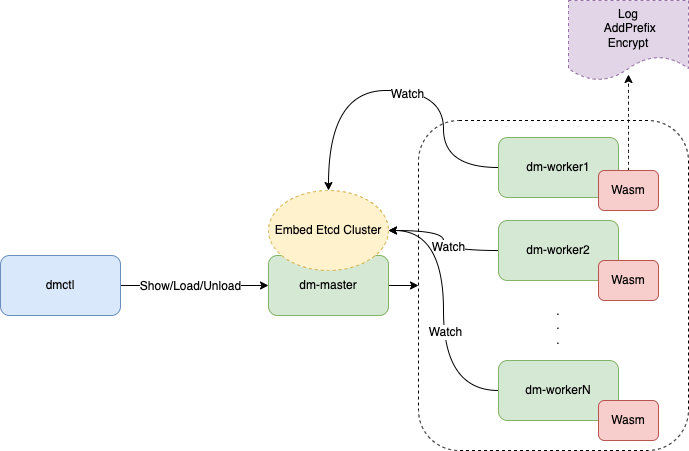

# 引言
本项目通过在 [tiflow](https://github.com/pingcap/tiflow) 项目内引入 Wasm 虚拟机，扩展 [DM](https://github.com/pingcap/tiflow/tree/master/dm) 组件的插件化开发能力，探索将 Wasm 作为未来 [DM](https://github.com/pingcap/tiflow/tree/master/dm) 工具多语言 ETL 能力的基座。 
# 团队
[eastfisher](https://github.com/eastfisher)
[yfaming](https://github.com/yfaming)
[niubell](https://github.com/niubell)
# 项目介绍
为 [DM](https://github.com/pingcap/tiflow/tree/master/dm) 内嵌 Wasm 虚拟机，增加几个新的插件，改变 [DM](https://github.com/pingcap/tiflow/tree/master/dm)复制过程中的行为表现。
# 背景
当前 DM 几个基础过滤功能都在 tidb-binlog 这个包内，包括 Table Router、Cloumn Mapping、Event Filter 等，我们打算扩展这几个基础组件，实现数据打印，添加数据前缀、指定列值脱敏等功能。
# 项目设计
## 架构设计

## 要点概述
- dmctl 通过 dm-master 组件管理 Wasm Code，包括：`dmctl wasm show | load | unload` 三个子命令
- 多个 dm-worker 通过 Watch 机制感知 Wasm Code 的变化，并加载最新版本
- 增加部分 Imports、Exports 函数，使得 Wasm 虚拟机可以和 Host 进行复杂数据交互，方便 Wasm Function 处理输入数据、输出应答
## 功能列表
- Log，打印 Value of Rows
- AddPrefix，给指定列值增加前缀
- Encrypt，给指定列值脱敏或加密，支持数据传输中一些隐私安全类的需求
# 小结
[DM](https://github.com/pingcap/tiflow/tree/master/dm) 作为一款高效的数据迁移工具，当前还不具备特别突出的多语言插件开发的能力，而 Wasm 虚拟机带来了这样一个契机，[DM](https://github.com/pingcap/tiflow/tree/master/dm) 作为一款流式数据复制组件，如果具备多语言、复杂插件的开发能力，就可以满足更多用户 ETL 的诉求，这也是我们做这个项目的一个初衷。